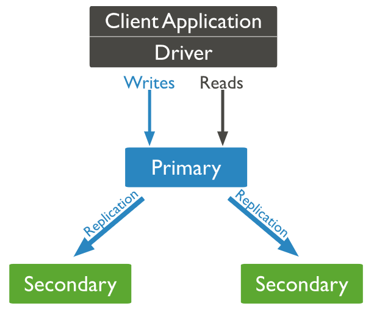

# MongoDB Replica Sets Guide

[TOC]

## MongoDB复制集简介

Mongodb复制集由一组Mongod实例（进程）组成，包含一个Primary节点和多个Secondary节点，Mongodb Driver（客户端）的所有数据都写入Primary，Secondary从Primary同步写入的数据，以保持复制集内所有成员存储相同的数据集，提供数据的高可用。

一个典型的Mongdb复制集，包含一个Primary节点和2个Secondary节点。



### Primary选举

复制集通过replSetInitiate命令（或mongo shell的rs.initiate()）进行初始化，初始化后各个成员间开始发送心跳消息，并发起Priamry选举操作，获得`大多数`成员投票支持的节点，会成为Primary，其余节点成为Secondary。

### “大多数”的定义

假设复制集内投票成员（后续介绍）数量为N，则大多数为 N/2 + 1，当复制集内存活成员数量不足大多数时，整个复制集将无法选举出Primary，复制集将无法提供写服务，处于只读状态。


|投票成员数|大多数|容忍失效数|
|---|---|---|
|1|1|0|
|2|2|0|
|3|2|1|
|4|3|1|
|5|3|2|
|6|4|2|
|7|4|3|

通常建议将复制集成员数量设置为奇数，从上表可以看出3个节点和4个节点的复制集都只能容忍1个节点失效，从`服务可用性`的角度看，其效果是一样的。（但无疑4个节点能提供更可靠的数据存储）

## 复制集部署

导入apt官方源的公钥
Import the public key used by the package management system.

```
sudo apt-key adv --keyserver hkp://keyserver.ubuntu.com:80 --recv 0C49F3730359A14518585931BC711F9BA15703C6
```

更具操作系统版本，使用下列命令创建`/etc/apt/sources.list.d/mongodb-org-3.4.list`文件
Create the /etc/apt/sources.list.d/mongodb-org-3.4.list list file using the command appropriate for your version of Ubuntu:

```
#Ubuntu 12.04
echo "deb [ arch=amd64 ] http://repo.mongodb.org/apt/ubuntu precise/mongodb-org/3.4 multiverse" | sudo tee /etc/apt/sources.list.d/mongodb-org-3.4.list
#Ubuntu 14.04
echo "deb [ arch=amd64 ] http://repo.mongodb.org/apt/ubuntu trusty/mongodb-org/3.4 multiverse" | sudo tee /etc/apt/sources.list.d/mongodb-org-3.4.list
#Ubuntu 16.04
echo "deb [ arch=amd64,arm64 ] http://repo.mongodb.org/apt/ubuntu xenial/mongodb-org/3.4 multiverse" | sudo tee /etc/apt/sources.list.d/mongodb-org-3.4.list
```

安装MongoDB包
Reload local package database.

```
sudo apt-get update
sudo apt-get install -y mongodb-org
```

创建集群

```
root@localhost:~# mongo 
MongoDB shell version v3.4.5
connecting to: mongodb://127.0.0.1:27017
MongoDB server version: 3.4.5
Welcome to the MongoDB shell.
For interactive help, type "help".
For more comprehensive documentation, see
	http://docs.mongodb.org/
Questions? Try the support group
	http://groups.google.com/group/mongodb-user
Server has startup warnings: 
2017-06-14T15:18:53.315+0800 I STORAGE  [initandlisten] 
2017-06-14T15:18:53.315+0800 I STORAGE  [initandlisten] ** WARNING: Using the XFS filesystem is strongly recommended with the WiredTiger storage engine
2017-06-14T15:18:53.315+0800 I STORAGE  [initandlisten] **          See http://dochub.mongodb.org/core/prodnotes-filesystem
2017-06-14T15:18:53.677+0800 I CONTROL  [initandlisten] 
2017-06-14T15:18:53.677+0800 I CONTROL  [initandlisten] ** WARNING: Access control is not enabled for the database.
2017-06-14T15:18:53.677+0800 I CONTROL  [initandlisten] **          Read and write access to data and configuration is unrestricted.
2017-06-14T15:18:53.677+0800 I CONTROL  [initandlisten] 
2017-06-14T15:18:53.678+0800 I CONTROL  [initandlisten] 
2017-06-14T15:18:53.678+0800 I CONTROL  [initandlisten] ** WARNING: /sys/kernel/mm/transparent_hugepage/enabled is 'always'.
2017-06-14T15:18:53.678+0800 I CONTROL  [initandlisten] **        We suggest setting it to 'never'
2017-06-14T15:18:53.678+0800 I CONTROL  [initandlisten] 
2017-06-14T15:18:53.678+0800 I CONTROL  [initandlisten] ** WARNING: /sys/kernel/mm/transparent_hugepage/defrag is 'always'.
2017-06-14T15:18:53.678+0800 I CONTROL  [initandlisten] **        We suggest setting it to 'never'
2017-06-14T15:18:53.678+0800 I CONTROL  [initandlisten] 
> use admin
switched to db admin
> config = { _id:"lingda", members:[ {_id:0, host:"192.168.100.4:27017"}, {_id:1, host:"192.168.100.17:27017"}, {_id:2, host:"192.168.100.18:27017"}] }
{
	"_id" : "lingda",
	"members" : [
		{
			"_id" : 0,
			"host" : "192.168.100.4:27017"
		},
		{
			"_id" : 1,
			"host" : "192.168.100.17:27017"
		},
		{
			"_id" : 2,
			"host" : "192.168.100.18:27017"
		}
	]
}
> rs.initiate(config);
{ "ok" : 1 }
lingda:SECONDARY> rs.status();
{
	"set" : "lingda",
	"date" : ISODate("2017-06-14T09:03:14.815Z"),
	"myState" : 1,
	"term" : NumberLong(1),
	"heartbeatIntervalMillis" : NumberLong(2000),
	"optimes" : {
		"lastCommittedOpTime" : {
			"ts" : Timestamp(1497430991, 1),
			"t" : NumberLong(1)
		},
		"appliedOpTime" : {
			"ts" : Timestamp(1497430991, 1),
			"t" : NumberLong(1)
		},
		"durableOpTime" : {
			"ts" : Timestamp(1497430991, 1),
			"t" : NumberLong(1)
		}
	},
	"members" : [
		{
			"_id" : 0,
			"name" : "192.168.100.4:27017",
			"health" : 1,
			"state" : 2,
			"stateStr" : "SECONDARY",
			"uptime" : 245,
			"optime" : {
				"ts" : Timestamp(1497430991, 1),
				"t" : NumberLong(1)
			},
			"optimeDurable" : {
				"ts" : Timestamp(1497430991, 1),
				"t" : NumberLong(1)
			},
			"optimeDate" : ISODate("2017-06-14T09:03:11Z"),
			"optimeDurableDate" : ISODate("2017-06-14T09:03:11Z"),
			"lastHeartbeat" : ISODate("2017-06-14T09:03:13.628Z"),
			"lastHeartbeatRecv" : ISODate("2017-06-14T09:03:14.218Z"),
			"pingMs" : NumberLong(0),
			"syncingTo" : "192.168.100.18:27017",
			"configVersion" : 1
		},
		{
			"_id" : 1,
			"name" : "192.168.100.17:27017",
			"health" : 1,
			"state" : 2,
			"stateStr" : "SECONDARY",
			"uptime" : 245,
			"optime" : {
				"ts" : Timestamp(1497430991, 1),
				"t" : NumberLong(1)
			},
			"optimeDurable" : {
				"ts" : Timestamp(1497430991, 1),
				"t" : NumberLong(1)
			},
			"optimeDate" : ISODate("2017-06-14T09:03:11Z"),
			"optimeDurableDate" : ISODate("2017-06-14T09:03:11Z"),
			"lastHeartbeat" : ISODate("2017-06-14T09:03:13.628Z"),
			"lastHeartbeatRecv" : ISODate("2017-06-14T09:03:14.731Z"),
			"pingMs" : NumberLong(0),
			"syncingTo" : "192.168.100.18:27017",
			"configVersion" : 1
		},
		{
			"_id" : 2,
			"name" : "192.168.100.18:27017",
			"health" : 1,
			"state" : 1,
			"stateStr" : "PRIMARY",
			"uptime" : 6261,
			"optime" : {
				"ts" : Timestamp(1497430991, 1),
				"t" : NumberLong(1)
			},
			"optimeDate" : ISODate("2017-06-14T09:03:11Z"),
			"electionTime" : Timestamp(1497430759, 1),
			"electionDate" : ISODate("2017-06-14T08:59:19Z"),
			"configVersion" : 1,
			"self" : true
		}
	],
	"ok" : 1
}
```

## 测试集群

### 验证一致性

在主库录入数据

```
root@localhost:~# mongo
MongoDB shell version v3.4.5
connecting to: mongodb://127.0.0.1:27017
MongoDB server version: 3.4.5
Welcome to the MongoDB shell.
For interactive help, type "help".
For more comprehensive documentation, see
	http://docs.mongodb.org/
Questions? Try the support group
	http://groups.google.com/group/mongodb-user
Server has startup warnings: 
2017-06-14T15:11:54.123+0800 I CONTROL  [initandlisten] 
2017-06-14T15:11:54.123+0800 I CONTROL  [initandlisten] ** WARNING: Access control is not enabled for the database.
2017-06-14T15:11:54.123+0800 I CONTROL  [initandlisten] **          Read and write access to data and configuration is unrestricted.
2017-06-14T15:11:54.123+0800 I CONTROL  [initandlisten] 
2017-06-14T15:11:54.123+0800 I CONTROL  [initandlisten] 
2017-06-14T15:11:54.123+0800 I CONTROL  [initandlisten] ** WARNING: /sys/kernel/mm/transparent_hugepage/enabled is 'always'.
2017-06-14T15:11:54.123+0800 I CONTROL  [initandlisten] **        We suggest setting it to 'never'
2017-06-14T15:11:54.123+0800 I CONTROL  [initandlisten] 
2017-06-14T15:11:54.123+0800 I CONTROL  [initandlisten] ** WARNING: /sys/kernel/mm/transparent_hugepage/defrag is 'always'.
2017-06-14T15:11:54.123+0800 I CONTROL  [initandlisten] **        We suggest setting it to 'never'
2017-06-14T15:11:54.123+0800 I CONTROL  [initandlisten] 
lingda:PRIMARY> use test
switched to db test
lingda:PRIMARY> db.test.insert({"id":"123"},{"name":"hello"});
WriteResult({ "nInserted" : 1 })
lingda:PRIMARY> 
```

在一个从库上验证数据

```
lingda:SECONDARY> use test
switched to db test
lingda:SECONDARY> show tables;
2017-06-20T10:45:27.057+0800 E QUERY    [thread1] Error: listCollections failed: {
	"ok" : 0,
	"errmsg" : "not master and slaveOk=false",
	"code" : 13435,
	"codeName" : "NotMasterNoSlaveOk"
} :
_getErrorWithCode@src/mongo/shell/utils.js:25:13
DB.prototype._getCollectionInfosCommand@src/mongo/shell/db.js:805:1
DB.prototype.getCollectionInfos@src/mongo/shell/db.js:817:19
DB.prototype.getCollectionNames@src/mongo/shell/db.js:828:16
shellHelper.show@src/mongo/shell/utils.js:762:9
shellHelper@src/mongo/shell/utils.js:659:15
@(shellhelp2):1:1
# mongodb默认是从主节点读写数据的，副本节点上不允许读，需要设置副本节点可以读。
lingda:SECONDARY> db.getMongo().setSlaveOk();
lingda:SECONDARY> show tables;
system.indexes
test
lingda:SECONDARY> db.test.find();
{ "_id" : ObjectId("5940fc8da92280f14a7a9d65"), "id" : "123" }
lingda:SECONDARY> 
```

### 验证primary、secondary自动切换

当primary不可用，则自动将合适的secondary成员切换成新的primary。

关闭primary

```
lingda:PRIMARY> use admin
switched to db admin
lingda:PRIMARY> db.shutdownServer();
server should be down...
2017-06-20T11:19:04.585+0800 I NETWORK  [thread1] trying reconnect to 127.0.0.1:27017 (127.0.0.1) failed
2017-06-20T11:19:04.585+0800 W NETWORK  [thread1] Failed to connect to 127.0.0.1:27017, in(checking socket for error after poll), reason: Connection refused
2017-06-20T11:19:04.585+0800 I NETWORK  [thread1] reconnect 127.0.0.1:27017 (127.0.0.1) failed failed 
2017-06-20T11:19:04.587+0800 I NETWORK  [thread1] trying reconnect to 127.0.0.1:27017 (127.0.0.1) failed
2017-06-20T11:19:04.587+0800 W NETWORK  [thread1] Failed to connect to 127.0.0.1:27017, in(checking socket for error after poll), reason: Connection refused
2017-06-20T11:19:04.587+0800 I NETWORK  [thread1] reconnect 127.0.0.1:27017 (127.0.0.1) failed failed
>
```

随机登录一台secondary，本例正好登录的是重新被选举成primary的服务器。

观察`stateStr`字段，可以看到原先的primary是离线状态。

```
lingda:PRIMARY> rs.status();
{
	"set" : "lingda",
	"date" : ISODate("2017-06-20T03:21:07.038Z"),
	"myState" : 1,
	"term" : NumberLong(7),
	"heartbeatIntervalMillis" : NumberLong(2000),
	"optimes" : {
		"lastCommittedOpTime" : {
			"ts" : Timestamp(1497928866, 1),
			"t" : NumberLong(7)
		},
		"appliedOpTime" : {
			"ts" : Timestamp(1497928866, 1),
			"t" : NumberLong(7)
		},
		"durableOpTime" : {
			"ts" : Timestamp(1497928866, 1),
			"t" : NumberLong(7)
		}
	},
	"members" : [
		{
			"_id" : 0,
			"name" : "192.168.100.4:27017",
			"health" : 1,
			"state" : 2,
			"stateStr" : "SECONDARY",
			"uptime" : 62801,
			"optime" : {
				"ts" : Timestamp(1497928866, 1),
				"t" : NumberLong(7)
			},
			"optimeDurable" : {
				"ts" : Timestamp(1497928866, 1),
				"t" : NumberLong(7)
			},
			"optimeDate" : ISODate("2017-06-20T03:21:06Z"),
			"optimeDurableDate" : ISODate("2017-06-20T03:21:06Z"),
			"lastHeartbeat" : ISODate("2017-06-20T03:21:06.839Z"),
			"lastHeartbeatRecv" : ISODate("2017-06-20T03:21:05.808Z"),
			"pingMs" : NumberLong(0),
			"syncingTo" : "192.168.100.17:27017",
			"configVersion" : 1
		},
		{
			"_id" : 1,
			"name" : "192.168.100.17:27017",
			"health" : 1,
			"state" : 1,
			"stateStr" : "PRIMARY",
			"uptime" : 496732,
			"optime" : {
				"ts" : Timestamp(1497928866, 1),
				"t" : NumberLong(7)
			},
			"optimeDate" : ISODate("2017-06-20T03:21:06Z"),
			"infoMessage" : "could not find member to sync from",
			"electionTime" : Timestamp(1497928754, 1),
			"electionDate" : ISODate("2017-06-20T03:19:14Z"),
			"configVersion" : 1,
			"self" : true
		},
		{
			"_id" : 2,
			"name" : "192.168.100.18:27017",
			"health" : 0,
			"state" : 8,
			"stateStr" : "(not reachable/healthy)",
			"uptime" : 0,
			"optime" : {
				"ts" : Timestamp(0, 0),
				"t" : NumberLong(-1)
			},
			"optimeDurable" : {
				"ts" : Timestamp(0, 0),
				"t" : NumberLong(-1)
			},
			"optimeDate" : ISODate("1970-01-01T00:00:00Z"),
			"optimeDurableDate" : ISODate("1970-01-01T00:00:00Z"),
			"lastHeartbeat" : ISODate("2017-06-20T03:21:06.875Z"),
			"lastHeartbeatRecv" : ISODate("2017-06-20T03:19:04.361Z"),
			"pingMs" : NumberLong(0),
			"lastHeartbeatMessage" : "Connection refused",
			"configVersion" : -1
		}
	],
	"ok" : 1
}
lingda:PRIMARY> 
```

重新启动原来就的primary库，然后查看集群状态，状态将会变成secondary。

## 复制集进阶

### 特殊的Secondary

正常情况下，复制集的Seconary会参与Primary选举（自身也可能会被选为Primary），并从Primary同步最新写入的数据，以保证与Primary存储相同的数据。

Secondary可以提供读服务，增加Secondary节点可以提供复制集的读服务能力，同时提升复制集的可用性。另外，Mongodb支持对复制集的Secondary节点进行灵活的配置，以适应多种场景的需求。

#### Arbiter

Arbiter节点只参与投票，不能被选为Primary，并且不从Primary同步数据。

比如你部署了一个2个节点的复制集，1个Primary，1个Secondary，任意节点宕机，复制集将不能提供服务了（无法选出Primary），这时可以给复制集添加一个Arbiter节点，即使有节点宕机，仍能选出Primary。

Arbiter本身不存储数据，是非常轻量级的服务，当复制集成员为偶数时，最好加入一个Arbiter节点，以提升复制集可用性。

#### Priority0

Priority0节点的选举优先级为0，不会被选举为Primary

比如你跨机房A、B部署了一个复制集，并且想指定Primary必须在A机房，这时可以将B机房的复制集成员Priority设置为0，这样Primary就一定会是A机房的成员。（注意：如果这样部署，最好将『大多数』节点部署在A机房，否则网络分区时可能无法选出Primary）

#### Vote0

Mongodb 3.0里，复制集成员最多50个，参与Primary选举投票的成员最多7个，其他成员（Vote0）的vote属性必须设置为0，即不参与投票。

#### Hidden

Hidden节点不能被选为主（Priority为0），并且对Driver不可见。

因Hidden节点不会接受Driver的请求，可使用Hidden节点做一些数据备份、离线计算的任务，不会影响复制集的服务。

#### Delayed

Delayed节点必须是Hidden节点，并且其数据落后与Primary一段时间（可配置，比如1个小时）。

因Delayed节点的数据比Primary落后一段时间，当错误或者无效的数据写入Primary时，可通过Delayed节点的数据来恢复到之前的时间点。

### 修改复制集配置

当需要修改复制集时，比如增加成员、删除成员、或者修改成员配置（如priorty、vote、hidden、delayed等属性），可通过replSetReconfig命令（rs.reconfig()）对复制集进行重新配置。

比如将复制集的第2个成员Priority设置为2，可执行如下命令

```
cfg = rs.conf();
cfg.members[1].priority = 2;
rs.reconfig(cfg);
```

### 细说Primary选举

Primary选举除了在复制集初始化时发生，还有如下场景
* 复制集被reconfig
* Secondary节点检测到Primary宕机时，会触发新Primary的选举
* 当有Primary节点主动stepDown（主动降级为Secondary）时，也会触发新的Primary选举

Primary的选举受节点间心跳、优先级、最新的oplog时间等多种因素影响。

### 节点间心跳

复制集成员间默认每2s会发送一次心跳信息，如果10s未收到某个节点的心跳，则认为该节点已宕机；如果宕机的节点为Primary，Secondary（前提是可被选为Primary）会发起新的Primary选举。

### 复制集的读写设置

#### Read Preference

默认情况下，复制集的所有读请求都发到Primary，Driver可通过设置Read Preference来将读请求路由到其他的节点。
* primary： 默认规则，所有读请求发到Primary
* primaryPreferred： Primary优先，如果Primary不可达，请求Secondary
* secondary： 所有的读请求都发到secondary
* secondaryPreferred：Secondary优先，当所有Secondary不可达时，请求Primary
* nearest：读请求发送到最近的可达节点上（通过ping探测得出最近的节点）

#### Write Concern

默认情况下，Primary完成写操作即返回，Driver可通过设置[Write Concern](https://docs.mongodb.org/manual/core/write-concern/)来设置写成功的规则。

如下的write concern规则设置写必须在大多数节点上成功，超时时间为5s。

```
db.products.insert(
  { item: "envelopes", qty : 100, type: "Clasp" },
  { writeConcern: { w: majority, wtimeout: 5000 } }
)
```

上面的设置方式是针对单个请求的，也可以修改副本集默认的write concern，这样就不用每个请求单独设置。

```
cfg = rs.conf()
cfg.settings = {}
cfg.settings.getLastErrorDefaults = { w: "majority", wtimeout: 5000 }
rs.reconfig(cfg)
```

### 异常处理（rollback）

当Primary宕机时，如果有数据未同步到Secondary，当Primary重新加入时，如果新的Primary上已经发生了写操作，则旧Primary需要回滚部分操作，以保证数据集与新的Primary一致。

旧Primary将回滚的数据写到单独的[rollback](https://docs.mongodb.org/manual/core/replica-set-rollbacks/)目录下，数据库管理员可根据需要使用mongorestore进行恢复。

> https://docs.mongodb.com/manual/replication/
